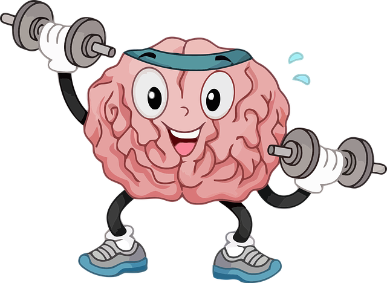
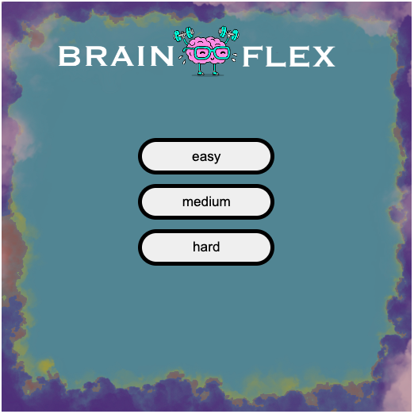
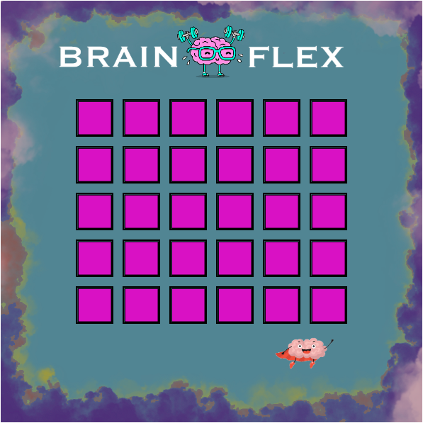
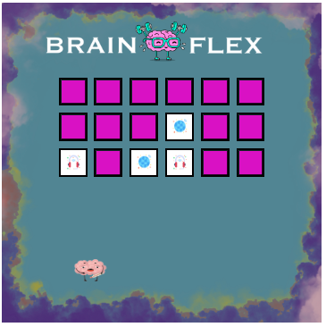
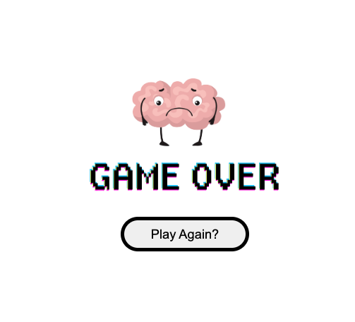

#  BrainFlex 
A memory skills challenge in which the player must pick two cards at a time to turn over in an attempt to locate matching pairs. Player must find all solutions before their lives ('brains') run out. 

This game has been known to enhance memory and boost cognitive skills by stimulating the brain. Additionally, the game of concentration may improve your focus and attention, as well as teach strategy and planning. 

## Screenshots

 

## Technologies Used:
* HTML
* CSS
* JAVASCRIPT

## Getting Started:

* Player chooses level: easy, medium, hard (images become tough to decipher as the level increase)
* Player has a total of five chances to guess the correct pairs.
* Player then chooses two cards in an attempt to find two matching pairs. If the cards do not match, they are turned back over and one life ('brain') is lost. 
* Once player runs out of lives the games is over; player can give it another shot by clicking: 'Play Again?'

https://dustinowen.github.io/BrainFlex/

## Future Enhancements:

* Lives variance based on difficulty level; possible timer feature for level hard. 
* Animation of a health meter below the hearts which decreases in the same fashion as the breais moving to better signify how many lives are left. 
* Winner screen with animation (brain gif) to be finalized.